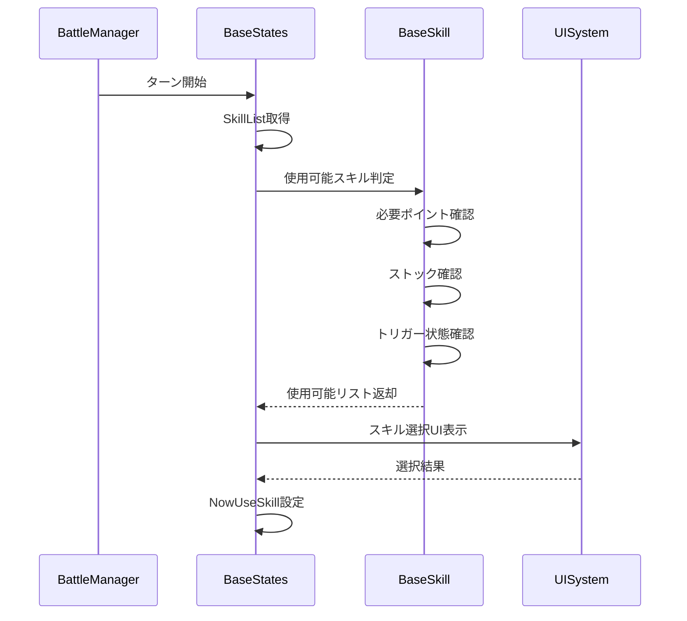
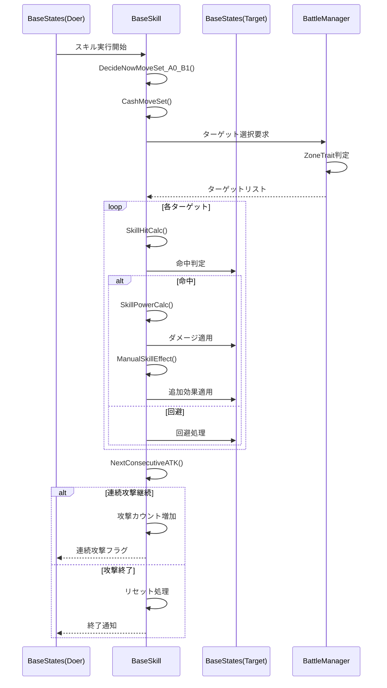
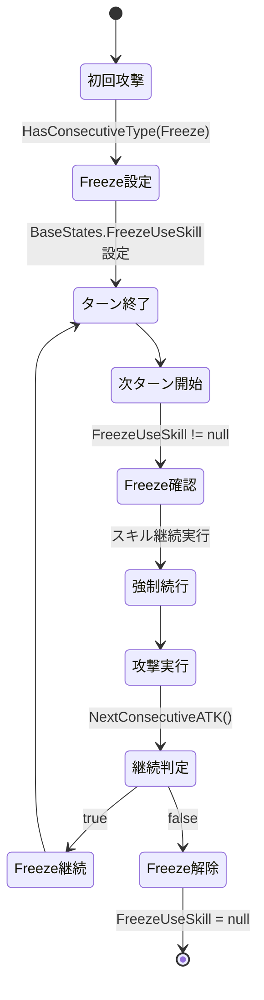
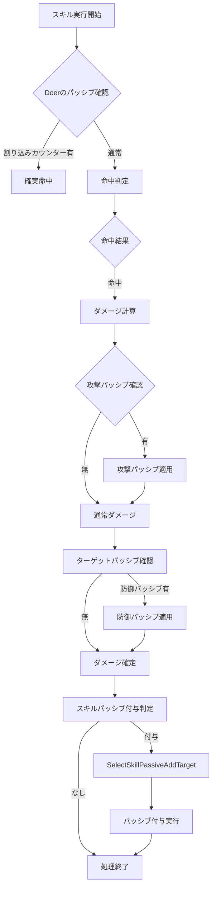
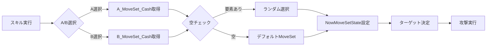
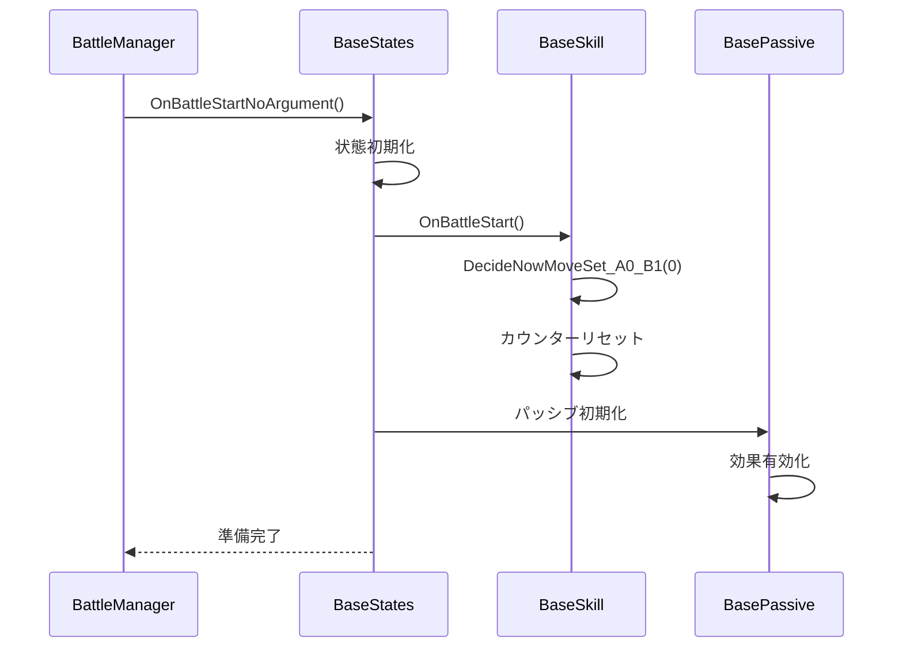
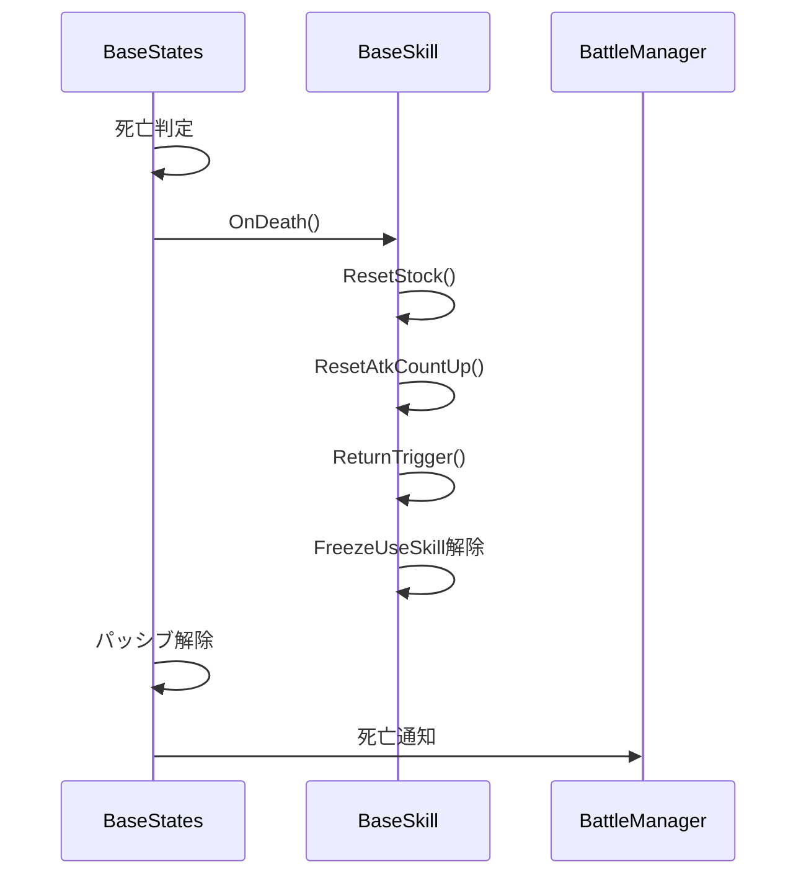

# BaseSkillとBaseStates 実行フロー詳細

## 1. スキル実行の完全フロー

### 1.1 スキル選択フェーズ



### 1.2 スキル実行フェーズ



## 2. ダメージ計算の詳細フロー

### 2.1 通常ダメージ計算

```csharp
// BaseSkill.SkillPowerCalc() の実行フロー
public float SkillPowerCalc(BaseStates underAtker, ...)
{
    // Step 1: スキルレベル決定
    var skillLevel = IsTLOA ? CalcCradleSkillLevel(underAtker) : _nowSkillLevel;
    
    // Step 2: 基礎威力取得
    var basePower = GetPowerForLevel(skillLevel);
    
    // Step 3: 攻撃者ステータス反映
    var atkPower = Doer.ATK().GetTotal();
    
    // Step 4: 防御者ステータス反映
    var defPower = underAtker.DEF().GetTotal();
    
    // Step 5: 属性相性計算
    var elementalModifier = CalculateElementalModifier(
        SkillSpiritual, 
        underAtker.MyImpression
    );
    
    // Step 6: 十日能力補正
    var tenDayModifier = CalculateTenDayModifier();
    
    // Step 7: 最終ダメージ
    return basePower * atkPower / defPower * elementalModifier * tenDayModifier;
}
```

### 2.2 精神ダメージ計算

```csharp
// 精神ダメージの計算フロー
public float CalculateMentalDamage(BaseStates target)
{
    // Step 1: 精神ダメージ比率取得
    var mentalRatio = MentalDamageRatio;
    
    // Step 2: 精神防御力取得
    var mentalDefense = target.MentalDefense;
    
    // Step 3: 精神属性相性
    var spiritualCompatibility = GetSpiritualCompatibility(
        Doer.MyImpression,
        target.MyImpression
    );
    
    // Step 4: 最終精神ダメージ
    return baseDamage * mentalRatio * spiritualCompatibility / mentalDefense;
}
```

## 3. 連続攻撃システムの詳細

### 3.1 FreezeConsecutive（ターン跨ぎ連続）



### 3.2 連続攻撃カウント管理

```csharp
// BaseSkillでのカウント管理
private int _atkCountUP;        // 現在の攻撃回数
public int ATKCount;             // 最大攻撃回数

// BaseStatesでの管理
public BaseSkill FreezeUseSkill; // ターン跨ぎスキル

// 連続攻撃の実行フロー
public bool ProcessConsecutiveAttack()
{
    // Step 1: 攻撃カウント増加
    _atkCountUP++;
    
    // Step 2: 連続タイプ別処理
    if (HasConsecutiveType(SkillConsecutiveType.FixedConsecutive))
    {
        // 固定回数：カウントが最大値に達するまで継続
        return _atkCountUP < ATKCount;
    }
    else if (HasConsecutiveType(SkillConsecutiveType.RandomPercentConsecutive))
    {
        // 確率連続：確率判定と最大回数チェック
        return _atkCountUP < ATKCount && 
               RandomEx.Shared.NextFloat(1) < _RandomConsecutivePer;
    }
    else if (HasConsecutiveType(SkillConsecutiveType.FreezeConsecutive))
    {
        // ターン跨ぎ：BaseStatesのFreezeUseSkillで管理
        if (_atkCountUP >= ATKCount)
        {
            Doer.FreezeUseSkill = null;
            return false;
        }
        Doer.FreezeUseSkill = this;
        return true;
    }
    
    return false;
}
```

## 4. パッシブシステムの相互作用

### 4.1 パッシブ効果の適用タイミング



### 4.2 スキルパッシブの付与フロー

```csharp
// BaseSkillからBaseStatesへのパッシブ付与
public async UniTask ApplySkillPassive(BaseStates target)
{
    // Step 1: 付与対象スキル選択
    var targetSkills = await SelectSkillPassiveAddTarget(target);
    
    // Step 2: 各スキルにパッシブ付与
    foreach (var skill in targetSkills)
    {
        // Step 3: パッシブ生成
        var passive = CreateSkillPassive();
        
        // Step 4: スキルに追加
        if (passive.IsReactive)
        {
            skill.ReactiveSkillPassiveList.Add(passive);
        }
        else if (passive.IsAggressive)
        {
            skill.AggressiveSkillPassiveList.Add(passive);
        }
        
        // Step 5: 効果適用
        passive.OnApply(skill);
    }
}
```

## 5. ターゲティングシステムの連携

### 5.1 範囲意志とゾーン特性の対応

```csharp
// BaseStatesの範囲意志
public enum RangeWill
{
    最も遠い味方 = 100,
    ランダムな味方 = 101,
    最も傷ついた味方 = 102,
    最も健康な味方 = 103,
    味方全体 = 104,
    // ... 敵版も同様
}

// BaseSkillのゾーン特性との対応
public SkillZoneTrait ZoneTrait { get; set; }

// BattleManagerでの解決
public List<BaseStates> ResolveTargets(BaseStates doer, BaseSkill skill)
{
    // Step 1: 基本ターゲット取得
    var baseTargets = GetTargetsByRangeWill(doer.CurrentRangeWill);
    
    // Step 2: スキルのゾーン特性適用
    var filteredTargets = ApplyZoneTrait(baseTargets, skill.ZoneTrait);
    
    // Step 3: 単体/全体判定
    if (skill.HasZoneTrait(SkillZoneTrait.単体))
    {
        return filteredTargets.Take(1).ToList();
    }
    else if (skill.HasZoneTrait(SkillZoneTrait.全体))
    {
        return filteredTargets;
    }
    
    // Step 4: MoveSet適用
    return ApplyMoveSet(filteredTargets, skill.NowMoveSetState);
}
```

### 5.2 MoveSetの決定プロセス



## 6. 属性ポイント消費システム

### 6.1 消費フロー

```csharp
// スキル実行時のポイント消費
public bool ExecuteSkillWithCost(BaseSkill skill)
{
    // Step 1: 必要ポイント確認
    var condition = new AttributeCondition
    {
        NormalP = skill.RequiredNormalP,
        AttributeP = skill.RequiredAttrP
    };
    
    // Step 2: BaseStatesでの消費試行
    if (!Doer.TryConsumeForSkillAtomic(condition))
    {
        return false; // ポイント不足
    }
    
    // Step 3: スキル実行
    skill.Execute();
    
    // Step 4: 消費履歴記録
    Doer.RecordAttributeConsumption(condition);
    
    return true;
}
```

## 7. ライフサイクル同期の詳細

### 7.1 戦闘開始時の初期化順序



### 7.2 死亡時のクリーンアップ



## 8. 特殊システムの連携

### 8.1 ゆりかごレベル計算の完全フロー

```csharp
// TLOAスキルのレベル計算
public int CalcCradleSkillLevel(BaseStates target)
{
    // Step 1: 基礎強さ比較
    float doerStrength = Doer.TenDayValuesSum(true);
    float targetStrength = target.TenDayValuesSum(false);
    float strengthRatio = doerStrength / targetStrength;
    
    // Step 2: 実効ライバハル計算
    float effectiveRivahal = Doer.Rivahal / Mathf.Max(1, strengthRatio);
    
    // Step 3: ルート位置算出
    float randomDivisor = RandomEx.Shared.NextFloat(1, skillLevelRandomDivisorMax);
    float root = effectiveRivahal + _nowSkillLevel / randomDivisor;
    
    // Step 4: 精神属性による調子補正
    var spiritualModifier = BaseStates.GetOffensiveSpiritualModifier(Doer, target);
    var moodRange = GetEstablishSpiritualMoodRange(spiritualModifier.GetValue(0.7f), 0.7f);
    
    // Step 5: パーティ属性相性補正
    moodRange = ModifyMoodByAttributeCompatibility(
        moodRange,
        Doer.MyImpression,
        manager.MyGroup(Doer).OurImpression
    );
    
    // Step 6: スキル使いこなし度
    float skillMastery = CalculateSkillMastery();
    float moodRangeRate = Mathf.Max(skillMastery - 2, RandomEx.Shared.NextFloat(2));
    
    // Step 7: 最終レベル決定
    return (int)(root + moodRange * moodRangeRate);
}
```

### 8.2 慣れ補正の適用

```csharp
// BaseStatesの慣れ記憶とBaseSkillの印象構造の連携
public float GetFamiliarityBonus(BaseSkill skill)
{
    // Step 1: スキル印象取得
    var impression = skill.Impression;
    var motionFlavor = skill.MotionFlavor;
    
    // Step 2: BaseStatesの慣れ記憶確認
    var familiarityLevel = GetFamiliarityLevel(impression, motionFlavor);
    
    // Step 3: 補正値計算
    float bonus = 1.0f;
    if (familiarityLevel > 0)
    {
        bonus += familiarityLevel * 0.05f; // 慣れレベルごとに5%ボーナス
    }
    
    return bonus;
}
```

## まとめ

BaseSkillとBaseStatesの連携は以下の階層で実現されている：

1. **データ層**: 相互参照（Doer/SkillList）
2. **実行層**: スキル実行フローの協調
3. **計算層**: ステータスとパラメータの共有
4. **制御層**: ライフサイクルの同期
5. **拡張層**: パッシブ・特殊システムの相互作用

この多層的な連携により、複雑なRPG戦闘システムが実現されている。