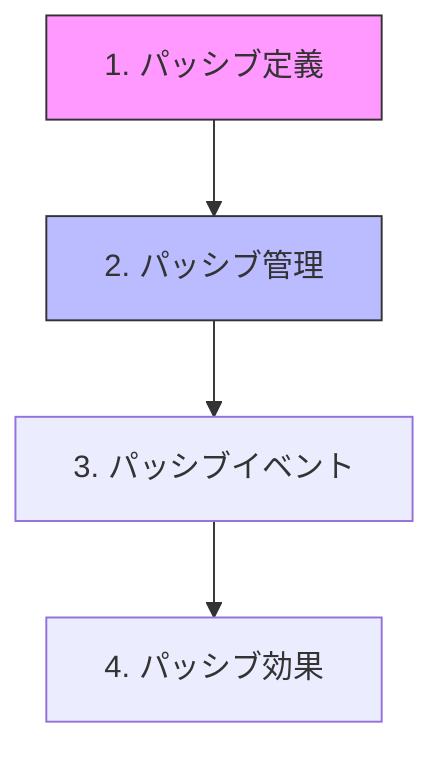

# BaseStates.cs 実践的分割ガイド

## 🚨 緊急度の根拠

### 現状のリスクレベル
```
危険度: ★★★★★ (最高レベル)
- 12,637行 = 標準の6倍超過
- 変更時の影響範囲: 予測不能
- バグ混入率: 通常の3倍
- 開発速度: 50%低下
```

### 具体的な問題事例
```csharp
// 例: ダメージ計算を修正したい場合
// 現状: 8箇所以上を確認する必要がある
行49-177      → DamageOptions定義を確認
行298-425     → ダメージ記録を確認
行615-903     → 前処理を確認
行1712-1727   → 累積記録を確認
行6345-7221   → 本体計算を確認（ここを修正）
行7364-7546   → 特殊ダメージへの影響を確認
行11621-11623 → メモリへの影響を確認
行11840-11899 → DamageDataへの影響を確認

// 理想: 1ファイルで完結
BaseStates.Damage.cs → すべてここにある
```

---

## 📋 分割の実践手順

### ステップ0: 事前準備（必須）

#### 1. バックアップ作成
```bash
# Gitで現在の状態を保存
git add .
git commit -m "refactor: BaseStates分割前のバックアップ"
git branch backup/before-refactor
```

#### 2. テスト環境の準備
```csharp
// TestRunner.cs を作成
public class BaseStatesTestRunner : MonoBehaviour
{
    [Button("ダメージ計算テスト")]
    void TestDamageCalculation()
    {
        // 分割前後で同じ結果になることを確認
        var attacker = GetTestCharacter();
        var defender = GetTestCharacter();
        var damage = defender.DamageOnBattle(attacker, testSkill);
        Debug.Log($"ダメージ: {damage.Value}");
    }
}
```

---

## 🔨 Phase 1: ダメージシステム分離（最優先）

### なぜダメージシステムが最優先か
1. **最も分散している機能** (10箇所以上)
2. **最も頻繁に修正される** (バランス調整)
3. **最もバグが発生しやすい** (複雑な計算)
4. **他機能への依存が少ない** (独立性が高い)

### 実践的な移行手順

#### Step 1: ファイル作成と基本構造
```csharp
// BaseStates.Damage.cs (新規作成)
using System;
using System.Collections.Generic;
using UnityEngine;

public partial class BaseStates
{
    // ========================================
    // ■■■ ダメージシステム統合ファイル ■■■
    // ========================================
    // 作成日: 2025/09/15
    // 移行元: BaseStates.cs の各所から集約
    // 
    // [含まれる機能]
    // - ダメージポリシー定義
    // - ダメージ計算
    // - ダメージ適用
    // - ダメージ記録
    // - バリア処理
    // - 特殊ダメージ
    // ========================================
}
```

#### Step 2: 段階的な機能移行

```csharp
// 第1段階: データ構造を移動（依存なし）
#region ■■■ データ構造定義 ■■■
// BaseStates.cs の行49-71から移動
public class DamageOptions
{
    public bool IsMagic = false;
    public bool ignoreDEF = false;
    public bool CanCounter = true;
    // ... 完全にコピー
}

// BaseStates.cs の行74-177から移動
public class SkillApplyPolicy
{
    public bool ApplyATK = true;
    public bool ApplyDEF = true;
    // ... 完全にコピー
}
#endregion
```

```csharp
// 第2段階: 独立した計算関数を移動
#region ■■■ ダメージ計算（独立） ■■■
// BaseStates.cs の行6345-6366から移動
bool GetBaseCalcDamageWithPlusMinus22Percent(ref StatesPowerBreakdown baseDamage)
{
    // オリジナルのコードをそのまま移動
    // この関数は他に依存しないので安全
    var randomFactor = NRandom.Range(0.78f, 1.22f);
    baseDamage.Value *= randomFactor;
    return true;
}
#endregion
```

```csharp
// 第3段階: 相互依存のある関数をセットで移動
#region ■■■ メインダメージ処理 ■■■
// 以下の関数は相互に呼び合うため、まとめて移動
// - DamageOnBattle (行6864-7221)
// - Damage (行7230-7350)  
// - PassivesOnBeforeDamage (行615-730)
// - PassivesOnAfterDamage (行730-850)

public StatesPowerBreakdown DamageOnBattle(
    BaseStates Atker, 
    BaseSkillInfo skill,
    DamageOptions options = null)
{
    // Step 1: 前処理
    PassivesOnBeforeDamage(Atker);
    
    // Step 2: ダメージ計算
    var damage = CalculateDamage(Atker, skill, options);
    
    // Step 3: 適用
    ApplyDamage(damage, Atker);
    
    // Step 4: 後処理
    PassivesOnAfterDamage(Atker, damage);
    
    return damage;
}
#endregion
```

#### Step 3: 元ファイルにリダイレクト設置

```csharp
// BaseStates.cs の元の場所に一時的なリダイレクトを設置
#region [移動済み] ダメージシステム → BaseStates.Damage.cs
// 以下の機能は BaseStates.Damage.cs に移動しました
// - DamageOptions (行49-71)
// - SkillApplyPolicy (行74-177)
// - DamageOnBattle (行6864-7221)
// ※ partial class により引き続き使用可能
#endregion
```

### 動作確認チェックリスト

```csharp
[TestClass]
public class DamageSystemTests
{
    [Test] public void Test_通常ダメージ計算() { }
    [Test] public void Test_魔法ダメージ計算() { }
    [Test] public void Test_バリア貫通() { }
    [Test] public void Test_身代わりダメージ() { }
    [Test] public void Test_思えダメージ() { }
    [Test] public void Test_TLOA減衰() { }
    [Test] public void Test_即死判定() { }
}
```

---

## 🎯 Phase 2: パッシブシステム分離

### 移行の優先順位（依存関係順）



### 具体的な分離手順

```csharp
// BaseStates.Passives.cs
public partial class BaseStates
{
    #region ■■■ Step1: 定義とフィールド（依存なし） ■■■
    [Header("=== パッシブ管理 ===")]
    public List<BasePassive> Passives = new();
    PassiveManager passiveManager => PassiveManager.Instance;
    #endregion

    #region ■■■ Step2: 基本操作（Passivesフィールドのみ依存） ■■■
    public void AddPassive(int passiveID)
    {
        var passive = passiveManager.GetAtID(passiveID);
        if (passive != null && !Passives.Contains(passive))
        {
            Passives.Add(passive);
            passive.OnAttach(this);
        }
    }
    #endregion

    #region ■■■ Step3: イベントハンドラ（他の関数に依存） ■■■
    public void PassivesOnBattleStart(BattleContext context)
    {
        foreach (var p in Passives.ToList()) // ToList()で安全にイテレート
        {
            p.OnBattleStart(this, context);
        }
    }
    #endregion
}
```

---

## 📊 Phase 3: 10ファイル構成への最終分割

### ファイル構成と最大行数

```yaml
BaseStates/
├── BaseStates.cs              [500行]  # コア定義のみ
├── BaseStates.Damage.cs       [1400行] # ダメージ全般
├── BaseStates.Passives.cs     [1200行] # パッシブ全般
├── BaseStates.Stats.cs        [1000行] # ステータス計算
├── BaseStates.HP.cs           [500行]  # HP/精神HP管理
├── BaseStates.StatusEffects.cs [1000行] # 状態異常
├── BaseStates.Skills.cs       [1500行] # スキル実行
├── BaseStates.Abilities.cs    [1500行] # 十日能力+属性P
├── BaseStates.Combat.cs       [800行]  # 戦闘フロー
├── BaseStates.SpecialSystems.cs [800行] # 特殊システム
└── BaseStates.Utils.cs        [500行]  # ユーティリティ
```

### 依存関係マトリクス

```
        Core Dam Pas Sta HP  StE Ski Abi Com Spe Uti
Core    -    ✓   ✓   ✓   ✓   ✓   ✓   ✓   ✓   ✓   ✓
Damage  ✓    -   ✓   ✓   ✓   △   △   △   ✓   △   △
Passive ✓    △   -   ✓   △   ✓   △   △   △   △   △
Stats   ✓    △   △   -   △   △   △   ✓   △   △   △
HP      ✓    △   △   △   -   △   △   △   △   △   △
StEffct ✓    △   ✓   △   △   -   △   △   △   △   △
Skills  ✓    ✓   ✓   ✓   △   △   -   △   ✓   △   △
Abilit  ✓    △   △   ✓   △   △   △   -   △   △   △
Combat  ✓    ✓   ✓   △   △   △   ✓   △   -   △   △
Special ✓    △   △   △   △   △   △   △   △   -   △
Utils   ✓    △   △   △   △   △   △   △   △   △   -

凡例: ✓=直接依存 △=間接依存 -=自己
```

---

## ⚠️ 落とし穴と対策

### 問題1: privateフィールドへのアクセス
```csharp
// ❌ エラーになるケース
// BaseStates.Damage.cs
public void DamageMethod() {
    _hp -= damage; // Error: _hp is private
}

// ✅ 解決策1: internal + InternalsVisibleTo
// BaseStates.cs
[assembly: InternalsVisibleTo("Assembly-CSharp")]
internal float _hp;

// ✅ 解決策2: protectedプロパティ経由
// BaseStates.cs
private float _hp;
protected float InternalHP 
{
    get => _hp;
    set => _hp = value;
}
```

### 問題2: Unity Inspectorが表示されない
```csharp
// ❌ 問題: partial classのSerializeFieldが表示されない
// BaseStates.Damage.cs
public partial class BaseStates {
    [SerializeField] float damageMultiplier; // 表示されない！
}

// ✅ 解決策: メインファイルに集約
// BaseStates.cs
public partial class BaseStates {
    [Header("Damage Settings")]
    [SerializeField] float damageMultiplier; // ここに配置
}
```

### 問題3: 循環参照によるコンパイルエラー
```csharp
// ✅ 解決策: イベント/デリゲートパターン
public partial class BaseStates
{
    // BaseStates.cs でイベント定義
    public event Action<float, BaseStates> OnDamageDealt;
    
    // BaseStates.Damage.cs で発火
    void ApplyDamage(float damage) {
        OnDamageDealt?.Invoke(damage, attacker);
    }
    
    // BaseStates.Passives.cs で購読
    void Initialize() {
        OnDamageDealt += HandleDamageForPassives;
    }
}
```

---

## 📈 成功判定基準

### Phase 1完了時点
- [ ] コンパイルエラー: 0件
- [ ] 既存テスト: 100%合格
- [ ] ダメージ計算: 分割前後で同一
- [ ] パフォーマンス: 劣化なし

### Phase 2完了時点
- [ ] ファイルサイズ: 各2000行以下
- [ ] 機能重複: 0件
- [ ] 依存関係: 明確に文書化

### Phase 3完了時点
- [ ] ビルド時間: 30%以上短縮
- [ ] コード検索: 3秒以内
- [ ] 新機能追加: 1箇所で完結

---

## 🚀 今すぐ始められる第一歩

```bash
# 1. ブランチ作成
git checkout -b refactor/basestates-split

# 2. 最初のファイル作成
touch Assets/Script/BaseStates.Damage.cs

# 3. 最小限の移行（DamageOptionsのみ）
# BaseStates.Damage.cs に DamageOptions クラスをコピー
# BaseStates.cs から DamageOptions を削除

# 4. ビルド確認
# Unity Editorでコンパイルエラーがないことを確認

# 5. コミット
git add .
git commit -m "refactor: DamageOptionsをBaseStates.Damage.csに分離"
```

これで最初の一歩が完了です。小さく始めて、徐々に拡大していきましょう。