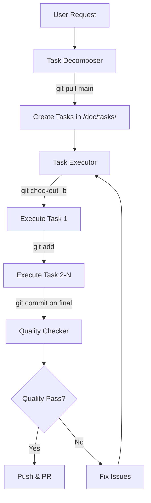

# Three-Agent Workflow System for pigRPG Development

## Overview
This workflow orchestrates three specialized agents to handle complex development tasks systematically. Each agent has its own detailed specification document and works together through shared task files.

## Agents and Documentation

### 1. Task Decomposer (`task-decomposer`)
- **Role**: Breaks down complex requirements into manageable tasks
- **Input**: Requirements from `/doc/plan/` or direct user input
- **Output**: Structured task files in `/doc/tasks/current/`
- **Spec Document**: `/doc/agents/task-decomposer.md`

### 2. Task Executor (`task-executor`)
- **Role**: Implements individual tasks with high quality using TDD
- **Input**: Task specifications from `/doc/tasks/current/`
- **Output**: Implemented code with tests (staged in git)
- **Spec Document**: `/doc/agents/task-executor.md`

### 3. Quality Checker (`quality-checker`)
- **Role**: Validates code quality and performance
- **Input**: Completed implementations from Task Executor
- **Output**: Quality report with fixes
- **Spec Document**: `/doc/agents/quality-checker.md`

## Git Operation Timing ⚠️ IMPORTANT

### When to Pull from Main
- **Task Decomposer**: At the beginning of a decomposition session ONLY
- **Task Executor**: At the beginning of the FIRST task execution ONLY
- **Quality Checker**: Never (works on current branch)

### Branch Strategy
```bash
# Decomposer creates requirements
git checkout main
git pull origin main

# Executor creates feature branch (ONCE per feature)
git checkout -b claude/[feature-name]

# All tasks executed on same branch
# Each task: git add only (NO COMMIT)
# Final task: git commit and push
```

## Workflow Process



## File Structure (Actual Paths)

```
pigRPG-Claude/
├── doc/
│   ├── agents/           # Agent specification documents
│   │   ├── task-decomposer.md
│   │   ├── task-executor.md
│   │   └── quality-checker.md
│   ├── plan/             # Requirements and planning docs
│   │   └── *.md
│   └── tasks/            # Task management
│       ├── _overview/    # Feature overview documents
│       │   └── {feature}-overview.md
│       ├── current/      # Active tasks to execute
│       │   └── {feature}-task-{NNN}.md
│       ├── completed/    # Archived completed tasks
│       │   └── {feature}-task-{NNN}.md
│       └── task-index.md # Master task registry
└── Assets/
    └── Scripts/          # Unity implementation files
        └── **/*.cs       # Only these can be edited
```

## Usage Examples with Claude Code

### Example 1: Complete Feature Workflow

```bash
# Step 1: Decompose the feature (creates tasks in /doc/tasks/current/)
# This will pull latest from main
task decomposer
> "Implement a skill system with cooldowns for characters"

# Step 2: Execute all tasks (reads from /doc/tasks/current/)
# First task will create feature branch
task executor
> "Execute next available task"
# Repeat until all tasks complete

# Step 3: Quality check on feature branch
task quality-checker
> "Validate all skill system implementations"
```

### Example 2: Resume Interrupted Work

```bash
# Check what tasks remain
ls /doc/tasks/current/*.md

# Continue execution (no git pull, continues on existing branch)
task executor
> "Continue with next task"
```

### Example 3: Bug Fix Workflow

```bash
# Quick fix without decomposition
task executor
> "Fix: Character movement stutters on low-end devices"

# Then validate
task quality-checker
> "Validate movement optimization fix"
```

## Task Metadata Format

Each task file includes standardized YAML header:
```yaml
---
task_id: TASK-[YYYYMMDD]-[NNN]
feature: [Feature Name]
created: [ISO 8601 timestamp]
status: pending|in-progress|completed
started_at: [ISO 8601 timestamp]
completed_at: [ISO 8601 timestamp]
dependencies: [task_id, task_id]
estimated_files: [number]
actual_files_changed: [number]
unity_systems: [Character, Battle, UI, etc.]
test_count: [number]
---
```

## Best Practices

### For Task Decomposition
1. Always check `/doc/plan/` for requirements first
2. Use Serena MCP to verify existing architecture
3. Keep tasks under 5 files (ideally 1-3)
4. Define clear, measurable success criteria
5. Save all tasks to `/doc/tasks/current/` immediately

### For Task Execution
1. Never edit .meta, .unity, or .prefab files
2. Follow TDD: Write tests → Fail → Implement → Pass → Refactor
3. Update task file progress in real-time
4. Stage changes per task (git add) but commit only at end
5. Use UniTask for async, LitMotion for animations

### For Quality Checking
1. Check after all tasks in a feature are complete
2. Focus on mobile performance metrics
3. Ensure test coverage > 80%
4. Validate no .meta files in staged changes
5. Fix critical issues before creating PR

## Performance Targets

### Mobile Optimization Requirements
- **FPS**: 60 on high-end, 30 minimum on low-end devices
- **Memory**: <1GB on iOS, <1.5GB on Android
- **Battery**: <50% CPU usage, <60% GPU usage average
- **Draw Calls**: <50 for UI, <100 for game scenes
- **Load Time**: <3 seconds initial, <1 second scene transitions

### Code Quality Metrics
- **Test Coverage**: >80% line coverage, >70% branch coverage
- **Complexity**: <10 cyclomatic complexity per method
- **File Size**: <500 lines per file
- **Documentation**: 100% public API documentation
- **No Allocations**: Zero per-frame allocations in Update/FixedUpdate

## Serena MCP Integration

All agents should utilize Serena MCP for codebase understanding:
- `mcp__serena__list_dir`: Explore directory structure
- `mcp__serena__find_file`: Locate specific files
- `mcp__serena__search_for_pattern`: Find code patterns
- `mcp__serena__get_symbols_overview`: Understand class structure

## Common Issues and Solutions

### Issue: Tasks Already Exist
```bash
# Check existing tasks
ls /doc/tasks/current/*.md
# If tasks exist, switch to executor instead of decomposer
```

### Issue: Merge Conflicts
```bash
# Always work from latest main for decomposition
git checkout main
git pull origin main
# Create new feature branch for execution
```

### Issue: Meta Files in Git
```bash
# Never add .meta files
git reset HEAD *.meta
# Only stage .cs files from Assets/Scripts/
git add Assets/Scripts/**/*.cs
```

### Issue: Lost Progress
```bash
# Tasks are saved in /doc/tasks/
# Check task status in file metadata
cat /doc/tasks/current/*.md | grep "status:"
```

## Quick Reference Commands

```bash
# View available tasks
ls -la /doc/tasks/current/

# Check task dependencies
grep "dependencies:" /doc/tasks/current/*.md

# Find completed tasks
ls -la /doc/tasks/completed/

# Check current git branch
git branch --show-current

# View staged changes (should be .cs only)
git diff --staged --name-only

# Verify no .meta files staged
git diff --staged --name-only | grep -E "\.meta$"
```

## Workflow State Management

The workflow maintains state through:
1. **Task Files**: Persistent state in `/doc/tasks/`
2. **Git Branches**: Feature isolation in `claude/[feature]`
3. **Task Metadata**: Progress tracking in YAML headers
4. **Task Index**: Master registry at `/doc/tasks/task-index.md`

## Integration Notes

- **Claude Code**: Each agent can be invoked independently
- **Memory**: No session memory required - all state in files
- **Continuity**: Any agent can resume from saved task state
- **Collaboration**: Multiple features can be worked on in parallel branches

## Critical Rules

1. **Never edit Unity meta files** - Let Unity manage them
2. **Always use TDD** - Tests first, implementation second
3. **One branch per feature** - All related tasks on same branch
4. **Stage incrementally** - Each task staged separately
5. **Commit once** - Only after all tasks complete
6. **Document everything** - Update task files continuously