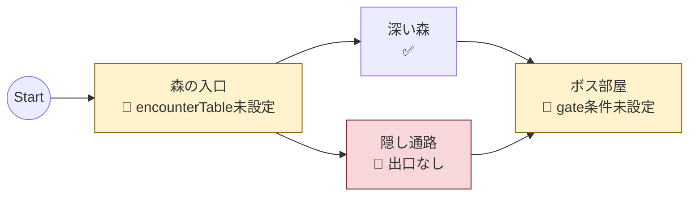

# ノード診断可視化ツール設計

FlowGraphSO の構造と設定状況を可視化し、診断結果を表示するツールの設計。

作成日: 2026-01-23

---

## 目的

1. **構造の可視化** - ノード接続の全体像を把握
2. **診断結果の表示** - 設定ミスや不整合を早期発見
3. **ドキュメント連携** - Markdown に埋め込み可能な形式で出力

---

## 出力形式

### 1. Mermaid 形式（グラフ可視化）

ノード接続を視覚的に表示。診断結果をノードラベルとスタイルで表現。

**用途:**
- ノード接続の全体像把握
- 接続ミスの発見
- ドキュメントへの埋め込み

**出力例:**



**スタイル定義:**

| 状態 | 色 | アイコン |
|------|-----|---------|
| 正常 | デフォルト | ✅ |
| 警告 | 黄 (#fff3cd) | 🔶 |
| エラー | 赤 (#f8d7da) | 🔴 |

---

### 2. CSV 形式（一覧表示）

全ノードの設定状況を表形式で出力。スプレッドシートでの確認・フィルタに適する。

**用途:**
- 全ノードの設定状況一覧
- 特定エラーのフィルタリング
- 設定漏れの網羅的チェック

**出力例:**

```csv
NodeId,DisplayName,ExitCount,GateCount,HasEncounterTable,HasSideObjects,Errors,Warnings
area1,森の入口,2,0,false,true,,encounterTable未設定
area2,深い森,1,0,true,true,,
area3,隠し通路,0,1,true,false,出口なし,
boss,ボス部屋,1,2,true,false,,gate[0]条件未設定
```

**カラム定義:**

| カラム | 型 | 説明 |
|--------|-----|------|
| NodeId | string | ノードID |
| DisplayName | string | 表示名 |
| ExitCount | int | 出口数 |
| GateCount | int | 門数 |
| HasEncounterTable | bool | 遭遇テーブル設定有無 |
| HasSideObjects | bool | サイドオブジェクト設定有無 |
| HasOnEnter | bool | onEnterEvent 設定有無 |
| HasCentralEvent | bool | centralEvent 設定有無 |
| Errors | string | エラー一覧（セミコロン区切り） |
| Warnings | string | 警告一覧（セミコロン区切り） |

---

## 診断項目

### 重大度: Error（グラフが正常に動作しない）

| ID | 項目 | 説明 |
|----|------|------|
| E001 | 出口なし | 出口が0個のノード（終端ノード以外） |
| E002 | 接続先不存在 | Exit.toNodeId が存在しないノードを参照 |
| E003 | 到達不能 | startNodeId から到達できないノード |
| E004 | 循環のみ | 出口に向かう経路がない閉じたループ |
| E005 | 開始ノード未設定 | startNodeId が空または存在しない |

### 重大度: Warning（動作するが設定漏れの可能性）

| ID | 項目 | 説明 |
|----|------|------|
| W001 | encounterTable未設定 | encounterRateMultiplier > 0 なのに encounterTable がnull |
| W002 | sideObjectTable未設定 | サイドオブジェクト機能を使わない意図か確認 |
| W003 | 門条件未設定 | GateMarker.passConditions が空 |
| W004 | 門イベント未設定 | GateMarker.gateEvent がnull |
| W005 | 出口条件未設定 | 複数出口があるのに conditions が全て空 |
| W006 | 表示名未設定 | displayName が空 |
| W007 | 重複ノードID | 同じ nodeId を持つノードが複数存在 |
| W008 | 出口ラベル未設定 | 複数出口があるのに uiLabel が空 |

### 重大度: Info（参考情報）

| ID | 項目 | 説明 |
|----|------|------|
| I001 | 単一出口 | 出口が1つのみ（分岐なし） |
| I002 | 高門数 | 門が3つ以上（複雑度の目安） |
| I003 | 長トラック | trackLength が 200 以上 |

---

## アーキテクチャ

```
FlowGraphSO
    ↓
┌─────────────────────────────────┐
│ GraphDiagnostics                │
│   - Validate(FlowGraphSO)       │
│   - Returns DiagnosticResult    │
└─────────────────────────────────┘
    ↓
DiagnosticResult
    ↓
┌─────────────┬─────────────┐
│ Mermaid     │ CSV         │
│ Exporter    │ Exporter    │
└─────────────┴─────────────┘
    ↓               ↓
.md file        .csv file
or clipboard    or clipboard
```

---

## ファイル構成

```
Assets/Editor/Walk/Diagnostics/
├── GraphDiagnostics.cs       # 診断ロジック
├── DiagnosticResult.cs       # 診断結果データ
├── DiagnosticEntry.cs        # 個別診断エントリ
├── MermaidExporter.cs        # Mermaid 出力
├── CsvExporter.cs            # CSV 出力
└── FlowGraphDiagnosticsWindow.cs  # (将来) エディタウィンドウ
```

---

## クラス設計

### DiagnosticEntry

```csharp
public enum DiagnosticSeverity
{
    Info,
    Warning,
    Error
}

public readonly struct DiagnosticEntry
{
    public string Id { get; }           // "E001", "W003" など
    public DiagnosticSeverity Severity { get; }
    public string NodeId { get; }       // 対象ノード（グラフ全体の場合はnull）
    public string Message { get; }      // 人間向けメッセージ
}
```

### DiagnosticResult

```csharp
public sealed class DiagnosticResult
{
    public IReadOnlyList<DiagnosticEntry> Entries { get; }

    public IEnumerable<DiagnosticEntry> GetEntriesForNode(string nodeId);
    public bool HasErrors { get; }
    public bool HasWarnings { get; }
    public int ErrorCount { get; }
    public int WarningCount { get; }
}
```

### GraphDiagnostics

```csharp
public sealed class GraphDiagnostics
{
    public DiagnosticResult Validate(FlowGraphSO graph)
    {
        var entries = new List<DiagnosticEntry>();

        ValidateStartNode(graph, entries);
        ValidateReachability(graph, entries);

        foreach (var node in graph.Nodes)
        {
            ValidateNode(node, graph, entries);
        }

        return new DiagnosticResult(entries);
    }

    void ValidateNode(NodeSO node, FlowGraphSO graph, List<DiagnosticEntry> entries)
    {
        ValidateExits(node, graph, entries);
        ValidateGates(node, entries);
        ValidateEncounter(node, entries);
        ValidateSideObjects(node, entries);
        ValidateDisplayName(node, entries);
    }
}
```

### MermaidExporter

```csharp
public static class MermaidExporter
{
    public static string Export(FlowGraphSO graph, DiagnosticResult diagnostics)
    {
        var sb = new StringBuilder();
        sb.AppendLine("```mermaid");
        sb.AppendLine("flowchart LR");

        // 開始ノード
        sb.AppendLine($"    start((Start)) --> {graph.StartNodeId}");

        // 各ノード
        foreach (var node in graph.Nodes)
        {
            var nodeEntries = diagnostics.GetEntriesForNode(node.NodeId).ToList();
            var label = BuildLabel(node, nodeEntries);
            sb.AppendLine($"    {SanitizeId(node.NodeId)}[{label}]");

            // スタイル
            var style = GetStyle(nodeEntries);
            if (style != null)
                sb.AppendLine($"    style {SanitizeId(node.NodeId)} {style}");

            // 接続
            foreach (var exit in node.Exits ?? Array.Empty<ExitCandidate>())
            {
                var edgeLabel = string.IsNullOrEmpty(exit.UILabel) ? "" : $"|{exit.UILabel}|";
                sb.AppendLine($"    {SanitizeId(node.NodeId)} -->{edgeLabel} {SanitizeId(exit.ToNodeId)}");
            }
        }

        sb.AppendLine("```");
        return sb.ToString();
    }

    static string BuildLabel(NodeSO node, List<DiagnosticEntry> entries)
    {
        var name = string.IsNullOrEmpty(node.DisplayName) ? node.NodeId : node.DisplayName;

        if (entries.Count == 0)
            return $"{name}<br/>✅";

        var worst = entries.Max(e => e.Severity);
        var icon = worst == DiagnosticSeverity.Error ? "🔴" : "🔶";
        var firstMessage = entries.First().Message;

        return $"{name}<br/>{icon} {firstMessage}";
    }

    static string GetStyle(List<DiagnosticEntry> entries)
    {
        if (entries.Count == 0) return null;

        var worst = entries.Max(e => e.Severity);
        return worst switch
        {
            DiagnosticSeverity.Error => "fill:#f8d7da,stroke:#721c24",
            DiagnosticSeverity.Warning => "fill:#fff3cd,stroke:#856404",
            _ => null
        };
    }

    static string SanitizeId(string id)
    {
        // Mermaid で使えない文字を置換
        return id?.Replace("-", "_").Replace(" ", "_") ?? "unknown";
    }
}
```

### CsvExporter

```csharp
public static class CsvExporter
{
    public static string Export(FlowGraphSO graph, DiagnosticResult diagnostics)
    {
        var sb = new StringBuilder();

        // ヘッダー
        sb.AppendLine("NodeId,DisplayName,ExitCount,GateCount,HasEncounterTable,HasSideObjects,HasOnEnter,HasCentralEvent,Errors,Warnings");

        foreach (var node in graph.Nodes)
        {
            var entries = diagnostics.GetEntriesForNode(node.NodeId).ToList();
            var errors = string.Join("; ", entries.Where(e => e.Severity == DiagnosticSeverity.Error).Select(e => e.Message));
            var warnings = string.Join("; ", entries.Where(e => e.Severity == DiagnosticSeverity.Warning).Select(e => e.Message));

            sb.AppendLine(string.Join(",",
                Escape(node.NodeId),
                Escape(node.DisplayName),
                node.Exits?.Length ?? 0,
                node.Gates?.Length ?? 0,
                node.EncounterTable != null,
                node.SideObjectTable != null,
                node.OnEnterEvent != null,
                node.CentralEvent != null,
                Escape(errors),
                Escape(warnings)
            ));
        }

        return sb.ToString();
    }

    static string Escape(string value)
    {
        if (string.IsNullOrEmpty(value)) return "";
        if (value.Contains(",") || value.Contains("\"") || value.Contains("\n"))
            return $"\"{value.Replace("\"", "\"\"")}\"";
        return value;
    }
}
```

---

## Unity エディタ統合

### メニュー項目

```
Walk/
├── Diagnostics/
│   ├── Export to Mermaid (Clipboard)    # Mermaid をクリップボードにコピー
│   ├── Export to Mermaid (File)         # .md ファイルとして保存
│   ├── Export to CSV (Clipboard)        # CSV をクリップボードにコピー
│   ├── Export to CSV (File)             # .csv ファイルとして保存
│   └── Run Diagnostics (Console)        # 診断結果をConsoleに出力
```

### 使用方法

1. Project ウィンドウで FlowGraphSO を選択
2. メニューから `Walk > Diagnostics > Export to Mermaid (Clipboard)` を選択
3. Markdown ファイルや GitHub Issue にペースト

---

## 出力先

| 形式 | 推奨出力先 |
|------|-----------|
| Mermaid | `doc/歩行システム設計/graphs/` または直接ドキュメントに埋め込み |
| CSV | `doc/歩行システム設計/diagnostics/` または一時ファイル |

---

## 将来拡張

### Phase 2: エディタウィンドウ

Unity 内で診断結果を一覧表示し、ノードをクリックすると Inspector で開く。

#### 開き方

```
Unity メニュー → Window → Walk → Flow Graph Diagnostics
```

または

```
FlowGraphSO を右クリック → Open Diagnostics
```

#### ウィンドウ全体像

```
┌─ Flow Graph Diagnostics ──────────────────────────────────────────────┐
│                                                                        │
│  Graph: [▼ SampleStage        ] [🔄 Refresh] [📋 Copy Mermaid] [💾 CSV]│
│                                                                        │
├─ Summary ──────────────────────────────────────────────────────────────┤
│                                                                        │
│   Total: 8 nodes    🔴 2 Errors    🔶 5 Warnings    ✅ 1 OK           │
│                                                                        │
├─ Issues ───────────────────────────────────────────────────────────────┤
│ [Filter: ▼ All  ] [🔍 Search...                    ]                  │
│                                                                        │
│ ┌──────┬──────────┬────────────────────────────────────────┬────────┐ │
│ │ 重大 │ ノード    │ 内容                                   │ 操作   │ │
│ ├──────┼──────────┼────────────────────────────────────────┼────────┤ │
│ │ 🔴   │ area3    │ E002: 接続先 area99 が存在しません      │ [Select]│ │
│ │ 🔴   │ deadend  │ E001: 出口がありません                  │ [Select]│ │
│ │ 🔶   │ area1    │ W001: encounterTable が未設定です       │ [Select]│ │
│ │ 🔶   │ boss     │ W003: gate[0] の通過条件が未設定です    │ [Select]│ │
│ │ 🔶   │ boss     │ W004: gate[1] の gateEvent が未設定です │ [Select]│ │
│ │ 🔶   │ area2    │ W006: displayName が未設定です          │ [Select]│ │
│ │ 🔶   │ hidden   │ W002: sideObjectTable が未設定です      │ [Select]│ │
│ └──────┴──────────┴────────────────────────────────────────┴────────┘ │
│                                                                        │
├─ Node Details ─────────────────────────────────────────────────────────┤
│                                                                        │
│  Selected: boss (ボス部屋)                                             │
│                                                                        │
│  Exits: 1          Gates: 2         Track: 150                         │
│  ├─ → ending       ├─ gate_puzzle   ├─ Length: 150                     │
│                    │   🔶 条件未設定  ├─ StepDelta: 1                   │
│                    └─ gate_battle                                      │
│                        🔶 イベント未設定                                 │
│                                                                        │
│  [Open in Inspector]                                                   │
│                                                                        │
└────────────────────────────────────────────────────────────────────────┘
```

#### UI構成

| セクション | 内容 |
|-----------|------|
| ヘッダー | グラフ選択、リフレッシュ、エクスポートボタン |
| Summary | ノード総数、エラー/警告/正常の件数 |
| Issues | フィルタ・検索付きの診断結果リスト |
| Node Details | 選択ノードの構造と問題箇所表示 |

#### 操作フロー

1. **ウィンドウを開く**
   - `Window → Walk → Flow Graph Diagnostics`

2. **グラフを選択**
   - ドロップダウンから選択
   - または Project で FlowGraphSO を選択すると自動切り替え

3. **診断結果を確認**
   - エラー/警告が一覧表示
   - フィルタで絞り込み可能（Error のみ、特定ノード等）

4. **問題のノードを選択**
   - `[Select]` ボタンをクリック
   - → Project で該当 NodeSO がハイライト
   - → Inspector に NodeSO が表示
   - → 直接編集可能

5. **修正後に再診断**
   - `[Refresh]` で再スキャン
   - 修正が反映されたか確認

#### 実装の複雑さ比較

| 手段 | 工数目安 | 備考 |
|------|---------|------|
| Mermaid/CSV 出力 | 1-2日 | Phase 1 |
| カスタムエディタ | 3-5日 | UI Toolkit 使用 |

### Phase 3: 自動診断

- FlowGraphSO 保存時に自動で診断を実行
- エラーがある場合は Console に警告を表示
- CI/CD でのバリデーションに利用

---

## 既存コードとの関係

| 既存 | 本設計との関係 |
|------|---------------|
| `GraphValidator.cs` | 診断ロジックの一部を流用可能 |
| `SimRunner.cs` | シミュレーション結果を診断に追加可能 |
| `WalkDebugLog.cs` | ランタイム診断との連携 |

---

## 実装優先度

| Phase | 内容 | 優先度 |
|-------|------|--------|
| 1 | GraphDiagnostics + MermaidExporter + CsvExporter | 高 |
| 2 | エディタウィンドウ | 中 |
| 3 | 自動診断・CI 連携 | 低 |

---

## 関連ドキュメント

- `ゼロトタイプ歩行システム設計書.md` - 歩行システム全体
- `GraphToolkitと歩行システムの相性評価.md` - 本ツール作成の背景
- `GraphToolkit未実装機能一覧.md` - Graph Toolkit の制約
