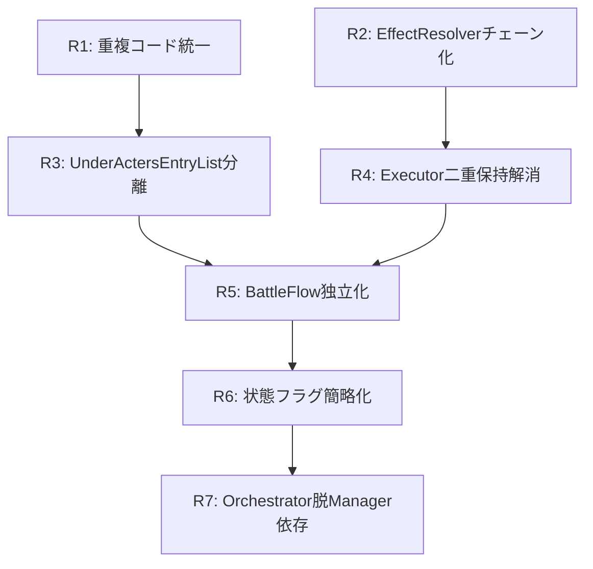

# BattleManager リファクタリング（完了）

## 概要

コミット `6b557a1` で BattleActionContext/BattleFlow/BattlePresentation が導入され、責務分離が進んだ。
本ドキュメントは、その後に残っていた課題と実施した改善をまとめる。

## 実施状況

| ID | 課題 | 状態 | 備考 |
|----|------|------|------|
| R1 | 重複コード統一 | **完了** | IBattleQueryService導入 |
| R2 | EffectResolverチェーン化 | **完了** | ISkillEffectパターン導入 |
| R3 | UnderActersEntryList分離 | **完了** | TargetDistributionService導入 |
| R4 | Executor二重保持解消 | **完了** | _context経由に統一 |
| R5 | BattleFlow独立化 | **完了** | BattleManager参照を完全削除 |
| R6 | 状態フラグ簡略化 | **スキップ** | 下記参照 |
| R7 | Orchestrator脱Manager依存 | **完了** | Context経由に変更 |

### R6 スキップ理由

3層構造（BattleState→BattleStateManager→BattleActionContext）を2層に統合する案だったが、以下の理由でスキップ:

1. **責務が明確に分離されている**
   - `BattleState`: 純粋なデータ保持
   - `BattleStateManager`: 状態遷移ガード（GuardTerminalTransition）
   - `BattleActionContext`: 全体の状態集約

2. **統合するとデメリットが発生**
   - `BattleActionContext` がさらに肥大化（既にQueryService, Unders, BeVanguard等を追加済み）
   - `BattleStateManager` 単体でのテストができなくなる

3. **変更リスクに対して利益が小さい**
   - 「プロパティ委譲が1段減る」だけで実行時パフォーマンス差はほぼゼロ

---

## 現状のアーキテクチャ

```
BattleManager (Facade層 - IBattleContext実装)
├─ BattleActionContext (状態集約層) ★導入済み
├─ BattleStateManager (戦闘終了判定)
├─ TurnScheduler (行動順序)
├─ BattlePresentation (UI/メッセージ) ★導入済み
├─ BattleUIBridge (UI中継)
├─ TurnExecutor (ターン実行)
├─ SkillExecutor (スキル実行)
├─ CharacterActExecutor (行動分岐)
├─ ActionSkipExecutor (スキップ処理)
├─ BattleFlow (進行制御) ★導入済み
└─ TargetingService/EffectResolver (戦闘効果)
```

---

## 残課題一覧

| ID | 課題 | 優先度 | 影響範囲 |
|----|------|--------|----------|
| R1 | 重複コード（IsVanguard等） | P0 | 3箇所以上 |
| R2 | EffectResolverの肥大化 | P0 | 効果追加時 |
| R3 | UnderActersEntryListの戦闘状態依存 | P0 | テスト困難 |
| R4 | TurnExecutor/SkillExecutorの二重保持 | P1 | 循環参照リスク |
| R5 | BattleFlowの過渡的設計 | P1 | 責務不明確 |
| R6 | 状態フラグの3層構造 | P1 | 同期ズレリスク |
| R7 | BattleOrchestratorのManager直参照 | P2 | 結合度 |

---

## R1: 重複コード（IsVanguard等）

### 現状

同一ロジックが複数箇所に存在する。

#### IsVanguard の重複

```csharp
// BattleActionContext.cs:137-142
public bool IsVanguard(BaseStates chara)
{
    if (AllyGroup != null && chara == AllyGroup.InstantVanguard) return true;
    if (EnemyGroup != null && chara == EnemyGroup.InstantVanguard) return true;
    return false;
}

// BattleManager.cs:659-664
public bool IsVanguard(BaseStates chara)
{
    if (allyGroup != null && chara == allyGroup.InstantVanguard) return true;
    if (enemyGroup != null && chara == enemyGroup.InstantVanguard) return true;
    return false;
}

// EffectResolver.cs:219-224
private static bool IsVanguard(BaseStates chara, BattleGroup allyGroup, BattleGroup enemyGroup)
{
    if (allyGroup != null && chara == allyGroup.InstantVanguard) return true;
    if (enemyGroup != null && chara == enemyGroup.InstantVanguard) return true;
    return false;
}
```

#### GetGroupForCharacter の重複

```csharp
// BattleActionContext.cs:129-132
public BattleGroup GetGroupForCharacter(BaseStates chara)
{
    return FactionToGroup(GetCharacterFaction(chara));
}

// EffectResolver.cs:205-210
private static BattleGroup GetGroupForChara(BaseStates chara, BattleGroup allyGroup, BattleGroup enemyGroup)
{
    if (allyGroup != null && allyGroup.Ours.Contains(chara)) return allyGroup;
    if (enemyGroup != null && enemyGroup.Ours.Contains(chara)) return enemyGroup;
    return null;
}

// BattleManager.cs:224
public BattleGroup MyGroup(BaseStates chara) => FactionToGroup(GetCharacterFaction(chara));
```

### 問題点

- 変更時に全箇所を修正する必要がある
- ロジックの不整合が起きやすい
- どれが正規の実装か不明確

### 改善案

`IBattleQueryService` インターフェースに統一する。

```csharp
// Assets/Script/Battle/Services/IBattleQueryService.cs (新規)
public interface IBattleQueryService
{
    bool IsVanguard(BaseStates chara);
    BattleGroup GetGroupForCharacter(BaseStates chara);
    allyOrEnemy GetCharacterFaction(BaseStates chara);
    List<BaseStates> GetOtherAlliesAlive(BaseStates chara);
}

// Assets/Script/Battle/Services/BattleQueryService.cs (新規)
public sealed class BattleQueryService : IBattleQueryService
{
    private readonly BattleGroup _allyGroup;
    private readonly BattleGroup _enemyGroup;

    public BattleQueryService(BattleGroup allyGroup, BattleGroup enemyGroup)
    {
        _allyGroup = allyGroup;
        _enemyGroup = enemyGroup;
    }

    public bool IsVanguard(BaseStates chara)
    {
        if (_allyGroup != null && chara == _allyGroup.InstantVanguard) return true;
        if (_enemyGroup != null && chara == _enemyGroup.InstantVanguard) return true;
        return false;
    }

    public BattleGroup GetGroupForCharacter(BaseStates chara)
    {
        if (_allyGroup != null && _allyGroup.Ours.Contains(chara)) return _allyGroup;
        if (_enemyGroup != null && _enemyGroup.Ours.Contains(chara)) return _enemyGroup;
        return null;
    }

    public allyOrEnemy GetCharacterFaction(BaseStates chara)
    {
        if (_allyGroup != null && _allyGroup.Ours.Contains(chara)) return allyOrEnemy.ally;
        if (_enemyGroup != null && _enemyGroup.Ours.Contains(chara)) return allyOrEnemy.enemy;
        return allyOrEnemy.ally; // デフォルト
    }

    public List<BaseStates> GetOtherAlliesAlive(BaseStates chara)
    {
        var group = GetGroupForCharacter(chara);
        if (group == null) return new List<BaseStates>();
        return group.Ours.Where(c => c != chara && c.Alive).ToList();
    }
}
```

### 移行手順

1. `BattleQueryService` を新規作成
2. `BattleActionContext` に `QueryService` プロパティを追加
3. 各クラスの重複メソッドを `QueryService` 呼び出しに置換
4. 旧メソッドに `[Obsolete]` を付与し、段階的に削除

---

## R2: EffectResolverの肥大化

### 現状

`EffectResolver.ResolveSkillEffectsAsync` が攻撃実行と派生効果3種を1メソッドで処理している。

```csharp
// Assets/Script/Battle/Services/EffectResolver.cs
public async UniTask ResolveSkillEffectsAsync(
    BaseStates acter,
    List<BaseStates> targets,
    Skill skill,
    int battleTurnCount,
    BattleGroup allyGroup,
    BattleGroup enemyGroup)
{
    skill.SetDeltaTurn(battleTurnCount);
    var message = await acter.AttackChara(targets);  // 攻撃実行

    TryAddFlatRoze(acter, targets, skill, allyGroup, enemyGroup);           // 派生効果1
    TryHelpMinusRecovelyTurnByCompatibility(acter, targets, allyGroup);     // 派生効果2
    TryAddRevengeBonus(acter, targets, allyGroup, enemyGroup);              // 派生効果3

    return message;
}
```

### 問題点

- 新効果追加時に `EffectResolver` を直接修正する必要がある
- 効果の実行順序が暗黙的
- 個別効果のテストが困難
- Open/Closed 原則に違反

### 改善案

エフェクトチェーンパターンを導入する。

```csharp
// Assets/Script/Battle/Effects/ISkillEffect.cs (新規)
public interface ISkillEffect
{
    /// <summary>効果の優先度（小さいほど先に実行）</summary>
    int Priority { get; }

    /// <summary>効果を適用すべきか判定</summary>
    bool ShouldApply(SkillEffectContext context);

    /// <summary>効果を適用</summary>
    UniTask Apply(SkillEffectContext context);
}

// Assets/Script/Battle/Effects/SkillEffectContext.cs (新規)
public sealed class SkillEffectContext
{
    public BaseStates Acter { get; }
    public List<BaseStates> Targets { get; }
    public Skill Skill { get; }
    public int BattleTurnCount { get; }
    public BattleGroup AllyGroup { get; }
    public BattleGroup EnemyGroup { get; }
    public IBattleQueryService QueryService { get; }

    // 効果間でデータを受け渡すための辞書
    public Dictionary<string, object> SharedData { get; } = new();
}

// Assets/Script/Battle/Effects/FlatRozeEffect.cs (新規)
public sealed class FlatRozeEffect : ISkillEffect
{
    public int Priority => 100;

    public bool ShouldApply(SkillEffectContext context)
    {
        // FlatRoze 発動条件の判定
        return context.Skill.HasFlatRozeCondition;
    }

    public UniTask Apply(SkillEffectContext context)
    {
        // FlatRoze 効果の実装
        // ...
        return UniTask.CompletedTask;
    }
}

// Assets/Script/Battle/Effects/HelpRecoveryEffect.cs (新規)
public sealed class HelpRecoveryEffect : ISkillEffect
{
    public int Priority => 200;

    public bool ShouldApply(SkillEffectContext context)
    {
        return context.Skill.IsHelpSkill;
    }

    public UniTask Apply(SkillEffectContext context)
    {
        // 回復補助効果の実装
        return UniTask.CompletedTask;
    }
}

// Assets/Script/Battle/Effects/RevengeBonusEffect.cs (新規)
public sealed class RevengeBonusEffect : ISkillEffect
{
    public int Priority => 300;

    public bool ShouldApply(SkillEffectContext context)
    {
        return context.Acter.HasRevengePassive;
    }

    public UniTask Apply(SkillEffectContext context)
    {
        // リベンジボーナスの実装
        return UniTask.CompletedTask;
    }
}

// Assets/Script/Battle/Effects/SkillEffectChain.cs (新規)
public sealed class SkillEffectChain
{
    private readonly List<ISkillEffect> _effects;

    public SkillEffectChain(IEnumerable<ISkillEffect> effects)
    {
        _effects = effects.OrderBy(e => e.Priority).ToList();
    }

    public async UniTask ExecuteAll(SkillEffectContext context)
    {
        foreach (var effect in _effects)
        {
            if (effect.ShouldApply(context))
            {
                await effect.Apply(context);
            }
        }
    }
}

// EffectResolver の改修
public sealed class EffectResolver
{
    private readonly SkillEffectChain _effectChain;

    public EffectResolver()
    {
        _effectChain = new SkillEffectChain(new ISkillEffect[]
        {
            new FlatRozeEffect(),
            new HelpRecoveryEffect(),
            new RevengeBonusEffect(),
        });
    }

    public async UniTask ResolveSkillEffectsAsync(SkillEffectContext context)
    {
        context.Skill.SetDeltaTurn(context.BattleTurnCount);
        var message = await context.Acter.AttackChara(context.Targets);

        await _effectChain.ExecuteAll(context);

        return message;
    }
}
```

### 移行手順

1. `ISkillEffect` と `SkillEffectContext` を新規作成
2. 既存の `TryAddFlatRoze` 等を `ISkillEffect` 実装クラスに変換
3. `SkillEffectChain` を作成し、`EffectResolver` に組み込み
4. 既存の `Try*` メソッドを削除

---

## R3: UnderActersEntryListの戦闘状態依存

### 現状

分散計算ロジックが `IBattleContext` に強く依存している。

```csharp
// Assets/Script/BattleManager.cs:37-183
public class UnderActersEntryList
{
    private readonly IBattleContext _context;

    public void CharaAdd(BaseStates chara)
    {
        var skill = _context.Acter.NowUseSkill;  // 戦闘状態への直接参照
        var cache = CashSpread;

        // 分散計算ロジック（爆発型/ビーム型/投げ型/ランダム）
        switch (skill.ZoneTrait)
        {
            case SkillZoneTrait.Spread:
                // 拡散計算
                break;
            case SkillZoneTrait.Beam:
                // ビーム計算
                break;
            // ...
        }
    }
}
```

### 問題点

- 分散計算のユニットテストが困難
- `SkillZoneTrait` 追加時の影響範囲が大きい
- UI層（ターゲット選択）と戦闘ロジックが混在

### 改善案

`TargetDistributionService` として切り出す。

```csharp
// Assets/Script/Battle/Services/ITargetDistributionService.cs (新規)
public interface ITargetDistributionService
{
    /// <summary>
    /// ターゲットへのダメージ分散比率を計算する
    /// </summary>
    /// <param name="distribution">分散結果を格納するリスト</param>
    /// <param name="acter">行動者</param>
    /// <param name="mainTarget">主ターゲット</param>
    /// <param name="allTargets">全ターゲット</param>
    /// <param name="skill">使用スキル</param>
    void CalculateDistribution(
        List<float> distribution,
        BaseStates acter,
        BaseStates mainTarget,
        IReadOnlyList<BaseStates> allTargets,
        Skill skill);
}

// Assets/Script/Battle/Services/TargetDistributionService.cs (新規)
public sealed class TargetDistributionService : ITargetDistributionService
{
    public void CalculateDistribution(
        List<float> distribution,
        BaseStates acter,
        BaseStates mainTarget,
        IReadOnlyList<BaseStates> allTargets,
        Skill skill)
    {
        distribution.Clear();

        var calculator = GetCalculator(skill.ZoneTrait);
        calculator.Calculate(distribution, acter, mainTarget, allTargets, skill);
    }

    private IDistributionCalculator GetCalculator(SkillZoneTrait trait)
    {
        return trait switch
        {
            SkillZoneTrait.Spread => new SpreadDistributionCalculator(),
            SkillZoneTrait.Beam => new BeamDistributionCalculator(),
            SkillZoneTrait.Throw => new ThrowDistributionCalculator(),
            SkillZoneTrait.Random => new RandomDistributionCalculator(),
            _ => new SingleTargetDistributionCalculator(),
        };
    }
}

// Assets/Script/Battle/Services/Distribution/IDistributionCalculator.cs (新規)
public interface IDistributionCalculator
{
    void Calculate(
        List<float> distribution,
        BaseStates acter,
        BaseStates mainTarget,
        IReadOnlyList<BaseStates> allTargets,
        Skill skill);
}

// Assets/Script/Battle/Services/Distribution/SpreadDistributionCalculator.cs (新規)
public sealed class SpreadDistributionCalculator : IDistributionCalculator
{
    public void Calculate(
        List<float> distribution,
        BaseStates acter,
        BaseStates mainTarget,
        IReadOnlyList<BaseStates> allTargets,
        Skill skill)
    {
        // 拡散型の分散計算（純粋な計算ロジックのみ）
        var mainIndex = allTargets.IndexOf(mainTarget);
        for (int i = 0; i < allTargets.Count; i++)
        {
            var distance = Math.Abs(i - mainIndex);
            var ratio = 1f / (1f + distance * skill.SpreadDecay);
            distribution.Add(ratio);
        }
    }
}
```

### UnderActersEntryList の改修

```csharp
public class UnderActersEntryList
{
    private readonly ITargetDistributionService _distributionService;
    private readonly List<float> _distributionCache = new();

    public UnderActersEntryList(ITargetDistributionService distributionService)
    {
        _distributionService = distributionService;
    }

    public void CharaAdd(BaseStates chara, BaseStates acter, Skill skill)
    {
        _distributionService.CalculateDistribution(
            _distributionCache,
            acter,
            chara,
            _charas,
            skill);

        // 分散結果を適用
        for (int i = 0; i < _charas.Count; i++)
        {
            _entries[i].Ratio = _distributionCache[i];
        }
    }
}
```

### 移行手順

1. `ITargetDistributionService` と `TargetDistributionService` を新規作成
2. 各 `SkillZoneTrait` 用の `IDistributionCalculator` 実装を作成
3. `UnderActersEntryList` のコンストラクタで `ITargetDistributionService` を受け取る
4. 既存の分散計算ロジックを `IDistributionCalculator` に移動
5. `IBattleContext` への依存を削除

---

## R4: TurnExecutor/SkillExecutorの二重保持

### 現状

`TurnExecutor` と `SkillExecutor` が `BattleManager` と `BattleActionContext` の両方を保持している。

```csharp
// Assets/Script/Battle/TurnExecutor.cs:5-6
public sealed class TurnExecutor
{
    private readonly BattleManager _manager;
    private readonly BattleActionContext _context;

    public void NextTurn(bool next)
    {
        _manager.NextTurn(false);           // BattleManager 経由
        _context.IncrementTurnCount();      // BattleActionContext 経由（二重管理？）
    }
}
```

### 問題点

- どちらが正規のアクセス経路か不明確
- 循環参照のリスク
- テスト時のモック設定が複雑

### 改善案

`BattleActionContext` のみを使用する設計に統一する。

```csharp
// TurnExecutor の改修
public sealed class TurnExecutor
{
    private readonly BattleActionContext _context;
    private readonly BattlePresentation _presentation;

    public TurnExecutor(BattleActionContext context, BattlePresentation presentation)
    {
        _context = context;
        _presentation = presentation;
    }

    public void NextTurn(bool advance)
    {
        if (advance)
        {
            _context.IncrementTurnCount();
        }

        _context.AllyGroup.OnPartyNextTurnNoArgument();
        _context.EnemyGroup.OnPartyNextTurnNoArgument();

        _presentation.OnTurnAdvanced(_context.BattleTurnCount);
    }
}

// SkillExecutor の改修
public sealed class SkillExecutor
{
    private readonly BattleActionContext _context;
    private readonly EffectResolver _effectResolver;
    private readonly BattlePresentation _presentation;

    public SkillExecutor(
        BattleActionContext context,
        EffectResolver effectResolver,
        BattlePresentation presentation)
    {
        _context = context;
        _effectResolver = effectResolver;
        _presentation = presentation;
    }

    public async UniTask<TabState> ExecuteSkill()
    {
        var acter = _context.Acter;
        var skill = acter.NowUseSkill;
        var targets = _context.Targets.GetTargetList();

        var effectContext = new SkillEffectContext
        {
            Acter = acter,
            Targets = targets,
            Skill = skill,
            BattleTurnCount = _context.BattleTurnCount,
            AllyGroup = _context.AllyGroup,
            EnemyGroup = _context.EnemyGroup,
            QueryService = _context.QueryService,
        };

        await _effectResolver.ResolveSkillEffectsAsync(effectContext);

        return _context.StateManager.CheckBattleEnd();
    }
}
```

### 移行手順

1. `TurnExecutor` から `_manager` 参照を削除
2. `BattleManager.NextTurn` の内部ロジックを `TurnExecutor` に移動
3. `SkillExecutor` も同様に `_manager` 参照を削除
4. `BattleManager` は `TurnExecutor`/`SkillExecutor` への委譲のみに

---

## R5: BattleFlowの過渡的設計

### 現状

`BattleFlow` が `BattleManager` への参照を持ち、単なる委譲になっている。

```csharp
// Assets/Script/Battle/Core/BattleFlow.cs:18
public sealed class BattleFlow
{
    private readonly BattleManager _manager;  // 過渡的な参照

    public TabState EscapeAct()
    {
        return _manager.EscapeACT();  // 単なる委譲
    }
}
```

### 問題点

- `BattleFlow` が純粋な進行制御層になっていない
- `BattleManager` への循環参照
- `EscapeHandler` との関係が不明確

### 改善案

`BattleFlow` を独立させ、必要なハンドラーを直接保持する。

```csharp
// BattleFlow の改修
public sealed class BattleFlow
{
    private readonly BattleActionContext _context;
    private readonly EscapeHandler _escapeHandler;
    private readonly CharacterActExecutor _characterActExecutor;
    private readonly TurnExecutor _turnExecutor;
    private readonly SkillExecutor _skillExecutor;
    private readonly BattlePresentation _presentation;

    public BattleFlow(
        BattleActionContext context,
        EscapeHandler escapeHandler,
        CharacterActExecutor characterActExecutor,
        TurnExecutor turnExecutor,
        SkillExecutor skillExecutor,
        BattlePresentation presentation)
    {
        _context = context;
        _escapeHandler = escapeHandler;
        _characterActExecutor = characterActExecutor;
        _turnExecutor = turnExecutor;
        _skillExecutor = skillExecutor;
        _presentation = presentation;
    }

    public TabState SelectNextActor()
    {
        // ACTPop のロジックをここに
        var next = _context.TurnScheduler.PopNext();
        if (next == null)
        {
            _turnExecutor.NextTurn(true);
            return TabState.TurnEnd;
        }

        _context.Acter = next;
        return _characterActExecutor.DetermineAction(_context);
    }

    public TabState EscapeAct()
    {
        return _escapeHandler.Execute(_context);
    }

    public async UniTask<TabState> ExecuteSkill()
    {
        return await _skillExecutor.ExecuteSkill();
    }

    public TabState DialogEndAct()
    {
        var state = _context.StateManager.CheckBattleEnd();
        if (state != TabState.None)
        {
            _presentation.OnBattleEnd(state);
        }
        return state;
    }
}
```

### 移行手順

1. `BattleFlow` から `_manager` 参照を削除
2. 必要なハンドラー/エグゼキューターをコンストラクタインジェクション
3. `EscapeACT` 等のロジックを `BattleFlow` 内に移動
4. `BattleManager` は `BattleFlow` への委譲のみに

---

## R6: 状態フラグの3層構造

### 現状

状態フラグが3層のラッパーを経由している。

```
BattleState (基本データ)
    ↓ ラップ
BattleStateManager (バリデーション付き)
    ↓ ラップ
BattleActionContext (さらにラップ)
    ↓ 委譲
BattleManager (公開API)
```

```csharp
// BattleState
public class BattleState
{
    public bool Wipeout { get; set; }
}

// BattleStateManager
public class BattleStateManager
{
    private readonly BattleState _state;
    public bool Wipeout
    {
        get => _state.Wipeout;
        set => _state.Wipeout = value;
    }
}

// BattleActionContext
public class BattleActionContext
{
    public bool Wipeout
    {
        get => StateManager.Wipeout;
        set => StateManager.Wipeout = value;
    }
}

// BattleManager
public class BattleManager
{
    public bool Wipeout
    {
        get => actionContext.Wipeout;
        set => actionContext.Wipeout = value;
    }
}
```

### 問題点

- 階層が深く、アクセス経路が冗長
- 同期ズレのリスク
- どの層で状態を変更すべきか不明確

### 改善案

2層構造に簡略化する。

```csharp
// BattleActionContext に BattleState を直接保持
public sealed class BattleActionContext
{
    // BattleStateManager を廃止し、BattleState を直接保持
    private readonly BattleState _state;

    // ヘルパークラスとして内部に持つ
    private readonly BattleStateGuard _stateGuard;

    public bool Wipeout
    {
        get => _state.Wipeout;
        set
        {
            _stateGuard.ValidateWipeoutChange(value);
            _state.Wipeout = value;
        }
    }

    public TabState CheckBattleEnd()
    {
        // BattleStateManager の CheckBattleEnd ロジックをここに
        if (_state.Wipeout) return TabState.Wipeout;
        if (_state.AlliesRunOut) return TabState.AlliesRunOut;
        if (_state.EnemyGroupEmpty) return TabState.EnemyGroupEmpty;
        return TabState.None;
    }
}

// BattleStateGuard (内部ヘルパー)
internal sealed class BattleStateGuard
{
    public void ValidateWipeoutChange(bool newValue)
    {
        // 必要に応じてバリデーション
    }
}
```

### 移行手順

1. `BattleStateManager` のロジックを `BattleActionContext` に統合
2. `BattleStateGuard` を内部ヘルパーとして作成
3. `BattleManager` の状態フラグプロパティを `actionContext` 直接参照に変更
4. `BattleStateManager` クラスを削除

---

## R7: BattleOrchestratorのManager直参照

### 現状

`BattleOrchestrator` が `BattleManager` のプロパティに直接アクセスしている。

```csharp
// Assets/Script/Battle/UI/BattleOrchestrator.cs
public sealed class BattleOrchestrator
{
    public BattleManager Manager { get; }

    private void SomeMethod()
    {
        var acts = Manager.Acts;           // 直接参照
        var unders = Manager.unders;       // 直接参照
        var acter = Manager.Acter;         // 直接参照
        var skillStock = Manager.SkillStock;
        var doNothing = Manager.DoNothing;
    }
}
```

### 問題点

- `IBattleContext` インターフェースを活かせていない
- `BattleManager` の具体実装に依存
- テスト時にモック置換が困難

### 改善案

`IBattleContext` 経由でアクセスする。

```csharp
// BattleOrchestrator の改修
public sealed class BattleOrchestrator
{
    private readonly IBattleContext _battleContext;

    public BattleOrchestrator(IBattleContext battleContext)
    {
        _battleContext = battleContext;
    }

    private void SomeMethod()
    {
        var acts = _battleContext.Acts;
        var unders = _battleContext.Targets;  // 名称統一
        var acter = _battleContext.Acter;
        var skillStock = _battleContext.SkillStock;
        var doNothing = _battleContext.DoNothing;
    }
}
```

### 移行手順

1. `BattleOrchestrator` のコンストラクタを `IBattleContext` 受け取りに変更
2. `Manager` プロパティを `[Obsolete]` に
3. 全ての `Manager.*` 参照を `_battleContext.*` に置換
4. `Manager` プロパティを削除

---

## 推奨実施順序



1. **R1: 重複コード統一** - 最も独立性が高く、他の変更に影響しない
2. **R2: EffectResolverチェーン化** - 独立性が高く、効果追加の障壁を下げる
3. **R3: UnderActersEntryList分離** - R1の `IBattleQueryService` を活用
4. **R4: Executor二重保持解消** - R2の `SkillEffectContext` を活用
5. **R5: BattleFlow独立化** - R4完了後に実施
6. **R6: 状態フラグ簡略化** - R5完了後に実施
7. **R7: Orchestrator脱Manager依存** - 最後に実施

---

## 補足: テスト戦略

各リファクタリング完了時に以下のテストを追加する。

### R1 完了時
```csharp
[Test]
public void IsVanguard_ReturnsTrue_WhenCharaIsAllyVanguard()
{
    var queryService = new BattleQueryService(allyGroup, enemyGroup);
    Assert.IsTrue(queryService.IsVanguard(allyGroup.InstantVanguard));
}
```

### R2 完了時
```csharp
[Test]
public async Task FlatRozeEffect_AppliesCorrectly()
{
    var effect = new FlatRozeEffect();
    var context = CreateTestContext();
    await effect.Apply(context);
    // アサーション
}
```

### R3 完了時
```csharp
[Test]
public void SpreadDistribution_CalculatesCorrectRatios()
{
    var calculator = new SpreadDistributionCalculator();
    var distribution = new List<float>();
    calculator.Calculate(distribution, acter, mainTarget, allTargets, skill);
    Assert.AreEqual(expectedRatios, distribution);
}
```

---

## 関連ドキュメント

- `doc/終了済み/Battle_Refactor_Priorities.md` - 前回の分割計画（完了済み）
- `doc/終了済み/BattleManager_Split_Design.md` - 分割設計（完了済み）
- `doc/終了済み/GlobalHub_Refactoring_Plan.md` - グローバルHub削減計画
